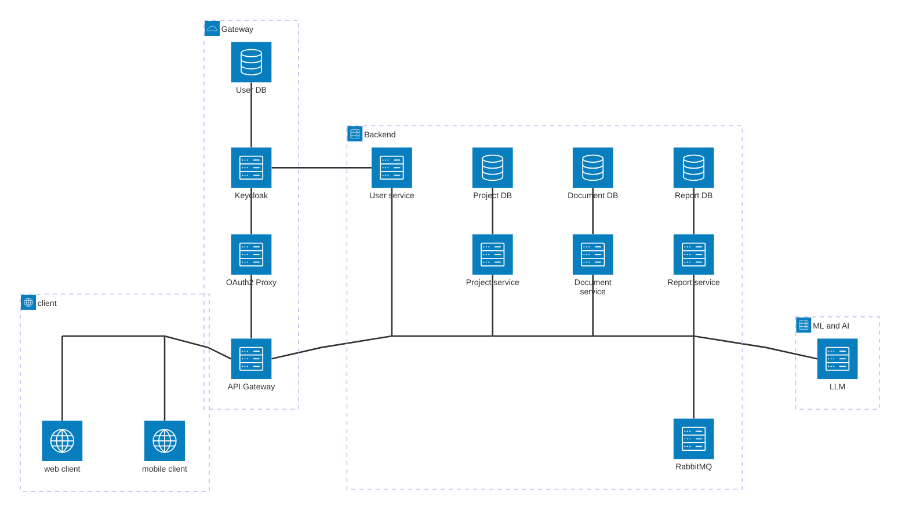

# System infrastructure
in this diagram shows infrastructure of this sytstem

```mermaid
architecture-beta
    group client(internet)[client]
    service web(internet)[web client] in client
    service mobile(internet)[mobile client] in client
    junction cj_1 in client
    junction cj_2 in client

    group gateway(cloud)[Gateway]
    service api_gateway(server)[API Gateway] in gateway
    service auth_proxy(server)[OAuth2 Proxy] in gateway
    service keycloak(server)[Keycloak] in gateway
    service user_db(database)[User DB] in gateway

    group backend(server)[Backend]
    service user_service(server)[User service] in backend
    service project_service(server)[Project service] in backend
    service project_db(database)[Project DB] in backend
    service report_service(server)[Report service] in backend
    service report_db(database)[Report DB] in backend
    service document_service(server)[Document service] in backend
    service document_db(database)[Document DB] in backend
    service rabbit_mq(server)[RabbitMQ] in backend
    junction bj_1 in backend
    junction bj_2 in backend
    junction bj_3 in backend
    junction bj_4 in backend

    group ml(server)[ML and AI]
    service llm(server)[LLM] in ml

    web:T -- B:cj_1
    mobile:T -- B:cj_2
    cj_1:R -- L:cj_2
    cj_2:R -- L:api_gateway

    api_gateway:T -- B:auth_proxy
    auth_proxy:T -- B:keycloak
    keycloak:R -- L:user_service
    user_db:B -- T:keycloak
    project_db:B -- T:project_service
    report_db:B -- T:report_service
    document_db:B -- T:document_service

    api_gateway:R -- L:bj_1
    bj_1:T -- B:user_service
    bj_1:R -- L:bj_2
    bj_2:T -- B:project_service
    bj_2:R -- L:bj_3
    bj_3:T -- B:document_service
    bj_3:R -- L:bj_4
    bj_4:T -- B:report_service
    bj_4:B -- T:rabbit_mq
    bj_4:R -- L:llm

```