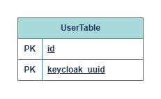

# Project service
This service is responsible for representation of user from keycloak in this application

## Database stucture

## Service structure
- **alembic** - Database migrations
- **api** - Routes and andpoints
- **db** - Interaction with database driver
- **messages** - Interaction with RabbitMQ Message broker within a corresponding service queue (one service - one queue)
- **models** - Representations of domain objects used in this service via SQLAlchemy models
- **schemas** - Pydantic serialization of transfered objects for reaching validation and unification