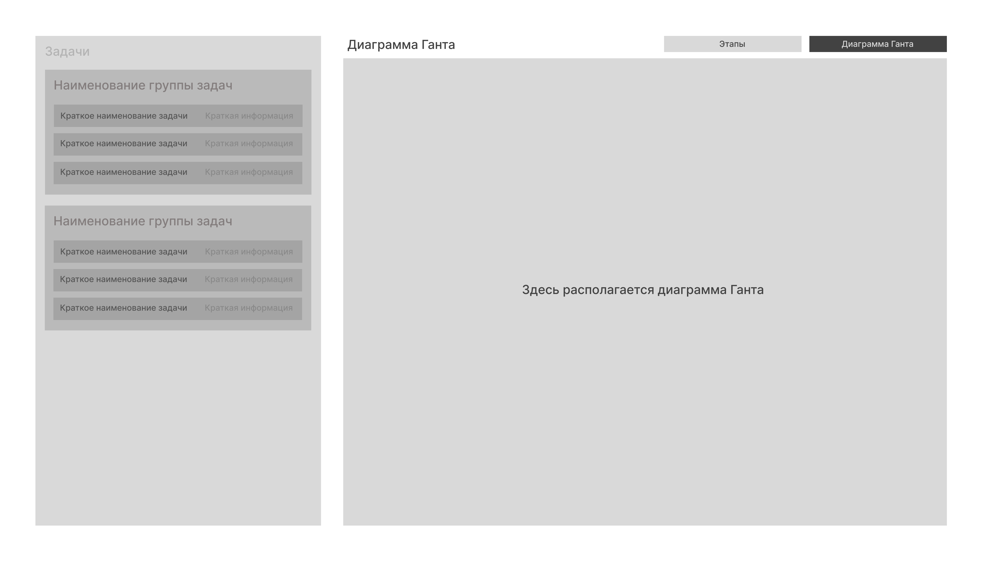

# Функциональные требования
В данном документе представлены функциональные требования к приложению:
- бизнес требования
- пользовательские сценарии
- макеты

## Бизнес требования (фитчи)

### Краткая сводка - ТРЕБУЕТСЯ ДОРАБОТАТЬ МАКЕТ
#### Краткое описание: 
Пользователь может быстро на главном экране осмотреть какие на данный момент задачи приоритетнее всего, что щас нужно сделать чтобы продвинуться по задаче, а так же какие были по ней изменения. Кроме того в задаче должны отображаться объем выполненных работ текущего шага **ТРЕБУЕТСЯ ДОБАВИТЬ ЭТО В МАКЕТ**
*Дополнительное задание - сортировка задач по их И/ИЛИ делайну/приоритету (Возможна реаилизация вне MVP)*
#### Обоснование:
Данная фитча позволит максимально быстро узнать руководителю проекта какие задачи горят наиболее ярким пламенем
#### Рамки и роли:
- Наличие проекта
- Роль руководитель проекта
#### AS-IS -> TO-BE:
ОТСУТСВУЕТ
#### Макеты:

### Краткий финансовый отчёт
#### Краткое описание: 
Пользователь может посмотреть краткую сводку по финансам - колличество финансов на данный момент, сколько было потрачено денег в целом, сколько ещё потребуется потратить учитывая спрогнозированные траты, круговая диаграмма соотношения распределения финансов в выполненные задачи / все задачи этапа, включая невыполненные задачи использующие спрогнозированные траты.Так же должен присутсвовать выбор между двумя вариантами (dropdown меню)
#### Обоснование:
Данная фитча позволит быстро проанализировать финансовую ситуацию в проекте
#### Рамки и роли:
- Наличие проекта
- Роль руководитель проекта
#### AS-IS -> TO-BE:
ОТСУТСВУЕТ
#### Макеты:

### Диаграмма ганта
#### Краткое описание: 
Взависимости от настроек и контекста пользователь может наблюдать за последовательностью текущих задач или добавлять их, изменять.
#### Обоснование:
Данная фитча позволит наглядно увидеть текущее положение дел в проекте - какая задача затянулась или наоборот была выполнена быстрее, чем полагалось и.т.п.
#### Рамки и роли:
- Наличие проекта
- Роль руководитель проекта
#### AS-IS -> TO-BE:
ОТСУТСВУЕТ
#### Макеты:

### Прямая трансляция с объекта
#### Краткое описание: 
Пользовател может наблюдать прямой эфир с объекта а так же выбрать с какой камеры будет отображаться трансляция
#### Обоснование:
Данная фитча позволит в реальном времени наблюдать как ведётся строительство
#### Рамки и роли:
- Наличие проекта
- Наличие камер с подключением к сети на объекте
- Роль руководитель проекта
#### AS-IS -> TO-BE:
ОТСУТСВУЕТ
#### Макеты:

### Планирование проекта
#### Краткое описание: 
Пользователь может управлять этапами, их задачами и группами задач.
- Этап - наибольшая единица проекта, отображающая переломные границы проекта
- Группа задач - данная единица отображает логически связанные вместе задачи
- Задача - наименьшая и неделимая единица работы в рамках проекта
#### Обоснование:
Данная фитча является основной и реализует одну из самых важных бизнес задач, позволяя РП (Руководителю проекта) планировать и управлять проектом
#### Рамки и роли:
- Наличие проекта
- Роль руководитель проекта
#### AS-IS -> TO-BE:
ОТСУТСВУЕТ
#### Макеты:

